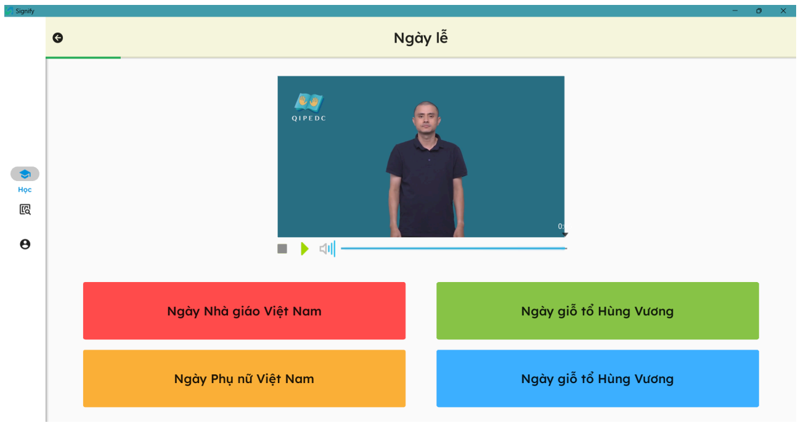

# Signify
- Một ứng dụng học tập ngôn ngữ kí hiệu với chức năng học tập qua các bài giảng, luyện tập trắc nghiệm và thực hiện mô phỏng lại động tác để luyện tập.

**Cách thức cài đặt Signify khi không tải được Python và requirements:**
- Truy cập https://drive.google.com/drive/folders/1bqcxdLvMsgZwmTgAfDgg3bDzSbwxO31V?usp=sharing
- Tải folder Signify về
- Giải nén nếu cần
- Chạy Signify.exe

**Cách deploy .exe (dành cho developer)**
1. Để tạo file .exe debug (có console chạy // với app) thì tải source từ branch master, nếu muốn loại bỏ console thì tải từ branch deploy-no-console (thông tin từ console vẫn sẽ xuất ra logs)
2. Cài pyinstaller
3. Chạy pyinstaller Signify.spec
4. Có thể tự chỉnh file .spec, datas=[('path to site-pakages/mediapipe/modules','mediapipe/modules'),..., nếu không thì thực hiện:
- Vào site-packages/mediapipe, copy modules
- Vào dist -> Signify -> _internal -> mediapipe, paste
4. Coppy assets, kivyfiles, local, model rồi paste vào dist -> Signify
5. Chạy .exe
